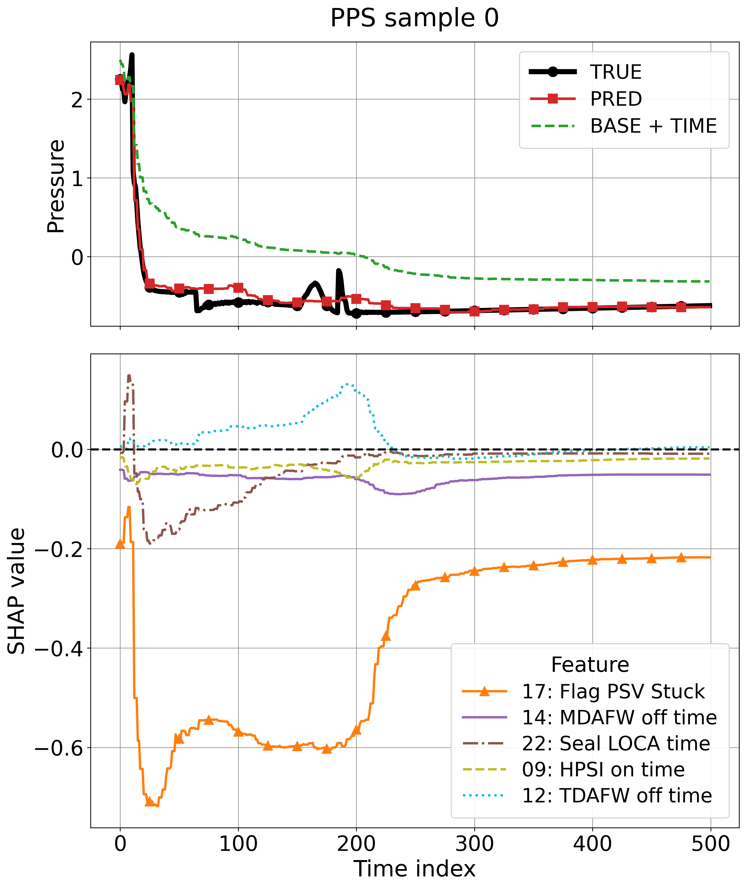

# Explainable Surrogate Modeling for Thermal-Hydraulic Codes in Nuclear Power Plants

정적 사고 시나리오 feature와 시간 feature를 결합해 열수력(TH) trajectory를 예측하고, SHAP을 이용해 시간별·시나리오별 기여도를 해석하는 surrogate modeling 프로젝트

> PPS 변수에 대한 trajectory prediction과 time-resolved SHAP attribution 예시

## Overview

원자력 안전해석용 TH 시뮬레이션을 빠르게 근사하기 위한 surrogate modeling 코드 Repository입니다.
정적 사고 시나리오 feature와 시간 feature를 결합해 TH 과도 응답을 예측하며, SHAP을 이용해 feature 기여도를 해석합니다.

- 입력: 사고 시나리오 파라미터 + 시간 feature
- 출력: 주요 TH 변수의 시계열 trajectory
- 모델: LightGBM
- 해석: TreeSHAP

---

## Repository Structure

    .
    │  README.md
    │  requirements.txt
    │
    ├─data
    │      README.md
    │
    ├─figures
    │  ├─global_shap
    │  ├─time_resolved_shap
    │  └─true_vs_pred
    │
    ├─out
    │  ├─evaluations
    │  ├─models
    │  ├─predictions
    │  ├─scalers
    │  └─shap
    │
    └─src
        │  01_train.py
        │  02_evaluate.py
        │  03_explain_shap.py
        │  config.py
        │  utils.py
        │
        └─visualization
               plot_global_shap_analysis.py
               plot_time_resolved_shap_analysis.py
               plot_true_vs_pred.py

- `data/`: 비공개 데이터 설명
- `src/`: 학습 / 평가 / SHAP 분석 / 시각화 코드
- `out/`: 모델, 예측값, 평가 지표, SHAP 결과 저장
- `figures/`: 대표 결과 그림

---

## Run

의존성 설치:

    pip install -r requirements.txt

실행:

    cd src
    python 01_train.py
    python 02_evaluate.py
    python 03_explain_shap.py
    python visualization/plot_true_vs_pred.py
    python visualization/plot_global_shap_analysis.py
    python visualization/plot_time_resolved_shap_analysis.py

---

## Main Files

- `01_train.py`: 모델 학습 및 저장
- `02_evaluate.py`: 예측 복원, 성능 평가, CSV 저장
- `03_explain_shap.py`: SHAP 값 계산 및 저장
- `visualization/*.py`: 예측 결과 및 SHAP 시각화

---

## Data

본 프로젝트에 사용된 원본 원자력 시뮬레이션 데이터는 보안상 공개하지 않습니다. 데이터의 입출력 형태(Shape)와 Feature 세부 설명은 [`data/README.md`](data/README.md)에서 확인하실 수 있습니다. 

---

## Outputs

평가 결과는 아래 경로에 저장됩니다.

- `out/evaluations/fold_metrics.csv`
- `out/evaluations/summary_metrics.csv`

대표 시각화 결과는 아래 폴더에 저장됩니다.

- `figures/global_shap/`
- `figures/true_vs_pred/`
- `figures/time_resolved_shap/`

---

## Notes

이 Repository는 코드와 실험 파이프라인 공개를 목적으로 하며, 원본 시뮬레이션 데이터는 포함하지 않습니다.